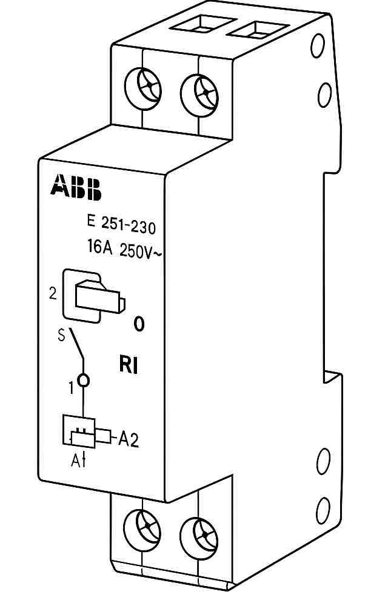

<td style="width: 10%;">
    
</td>

## **CENTRO FEDERAL DE EDUCAÇÃO TECNOLÓGICA DE MINAS GERAIS**  
## **Departamento de Engenharia Elétrica - CEFET-MG**  
## **Coordenação do Curso de Eletrotécnica**  

## Disciplina: **PLIP - Prática de Laboratório de Instalações Prediais**
## Guia de Aula –  Relé de Impulso (RI)

## 1. Introdução

O **relé de impulso (RI)** foi patenteado por **Piero Giordanino**, em
**1949**, com a finalidade de permitir o **comando de uma lâmpada ou
conjunto de lâmpadas a partir de vários pontos distintos**.\
Ele substitui a combinação tradicional de **interruptores paralelos e
intermediários** por **interruptores pulsadores** (botões de pressão)
com contato **normalmente aberto**.

O RI é um dispositivo **eletromecânico**, composto por: - **Bobina** -
**Mecanismo de alavanca** - **Roda dentada e eixo tipo came** -
**Contatos elétricos**

A cada **pulso de tensão**, a roda dentada altera a posição do eixo tipo
came (entre vale e crista), mudando o estado do contato elétrico
(aberto/fechado).

---

## 2. Relé de Impulso ABB E 251-230

O relé utilizado nesta atividade prática é o modelo **ABB -- Série E
251-230**.

### Características:

-   **Tensão da bobina:** 220 V\
-   **Corrente nominal:** 16 A\
-   **Chave comutadora**:
    -   **"1"** → Ligado permanentemente\
    -   **"0"** → Controle via pulsadores

### Terminais:

| Terminal | Função                               |
|----------|---------------------------------------|
| **2**    | Entrada da fase R                     |
| **1**    | Retorno para a lâmpada                |
| **A1**   | Alimentação da bobina (fase R)        |
| **A2**   | Retorno da bobina (fase S ou neutro)  |

  

---

## 1. Desenho simbólico na planta baixa

Representar: 

- Eletrodutos
- Pontos de luz\
- Interruptores\
- Tomadas\
- Caixas de passagem

---

## 2. Diagrama unifilar do QDFL

Incluir: 

1. 01 DTMG bipolar
2. 02 DPS 
3. 01 IDR bipolar
4. 01 RI ABB 251-230 (220 V)

---

# 3. Execução prática no Box Didático

1.  Lançar os condutores
2.  Realizar as conexões
3.  Solicitar conferência ao professor
4.  Isolar emendas e energizar
5.  Desinstalar equipamentos mantendo condutores presos
6.  Retirar e organizar a fiação
7.  Guardar sonda
8.  Limpar área de trabalho

# 4. Referencia bibliográfica

ALMEIDA, Welington Passos de. Guia de aula: Laboratório de Instalações Elétricas Prediais. Belo Horizonte: CEFET-MG, Curso de Eletrotécnica, 2025.
